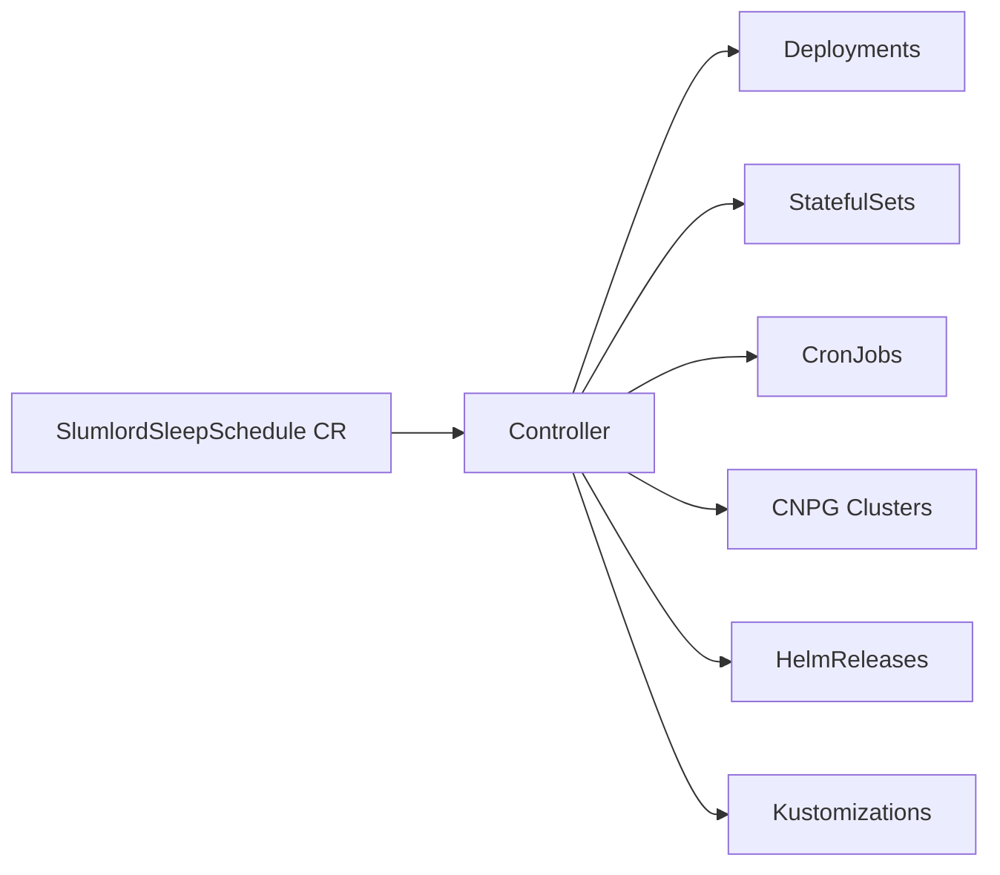

# Slumlord

Kubernetes operator for cost optimization -- automatically scales down workloads during off-hours.

## Features

- Scales Deployments and StatefulSets to zero replicas
- Suspends CronJobs, FluxCD HelmReleases and Kustomizations
- Hibernates CNPG PostgreSQL clusters
- Timezone-aware scheduling with day-of-week filters
- Overnight schedule support (e.g., 22:00-06:00)
- Label selectors and name-based matching (with wildcards)
- State preservation -- original replica counts, suspend states, and hibernation annotations are stored for restoration

## Installation

### Helm (recommended)

```bash
helm install slumlord oci://ghcr.io/cschockaert/charts/slumlord --version 0.2.0
```

### From source

```bash
make install  # Install CRDs
make run      # Run locally against current kubeconfig
```

## Usage

### Basic example -- nightly sleep on weekdays

```yaml
apiVersion: slumlord.io/v1alpha1
kind: SlumlordSleepSchedule
metadata:
  name: nightly-sleep
spec:
  selector:
    matchLabels:
      slumlord.io/managed: "true"
    types:
      - Deployment
      - StatefulSet
  schedule:
    start: "22:00"
    end: "06:00"
    timezone: Europe/Paris
    days: [1, 2, 3, 4, 5]
```

### Weekend shutdown

```yaml
apiVersion: slumlord.io/v1alpha1
kind: SlumlordSleepSchedule
metadata:
  name: weekend-stop
spec:
  selector:
    matchLabels:
      slumlord.io/managed: "true"
    types:
      - Deployment
      - StatefulSet
      - CronJob
  schedule:
    start: "00:00"
    end: "23:59"
    timezone: Europe/Paris
    days: [0, 6]
```

### CNPG PostgreSQL hibernation

```yaml
apiVersion: slumlord.io/v1alpha1
kind: SlumlordSleepSchedule
metadata:
  name: pg-hibernate
spec:
  selector:
    matchLabels:
      slumlord.io/managed: "true"
    types:
      - Cluster
  schedule:
    start: "20:00"
    end: "07:00"
    timezone: Europe/Paris
    days: [1, 2, 3, 4, 5]
```

### FluxCD reconciliation suspend

```yaml
apiVersion: slumlord.io/v1alpha1
kind: SlumlordSleepSchedule
metadata:
  name: flux-suspend
spec:
  selector:
    matchLabels:
      slumlord.io/managed: "true"
    types:
      - HelmRelease
      - Kustomization
  schedule:
    start: "21:55"
    end: "06:05"
    timezone: Europe/Paris
    days: [1, 2, 3, 4, 5]
```

> **Important**: When managing FluxCD resources alongside Deployments/StatefulSets, use a wider sleep window for the FluxCD schedule. Suspend Flux reconciliation before scaling workloads, and resume it after restoring them. This prevents Flux from restoring scaled-down workloads during the sleep window.

## CRD Reference

### SlumlordSleepSchedule

| Field | Type | Required | Description |
|-------|------|----------|-------------|
| `spec.selector.matchLabels` | `map[string]string` | No | Label selector for target workloads |
| `spec.selector.matchNames` | `[]string` | No | Name patterns (supports wildcards) |
| `spec.selector.types` | `[]string` | No | Workload types to manage. Valid: `Deployment`, `StatefulSet`, `CronJob`, `Cluster`, `HelmRelease`, `Kustomization`. Default: all types |
| `spec.schedule.start` | `string` | Yes | Sleep start time in `HH:MM` format |
| `spec.schedule.end` | `string` | Yes | Wake time in `HH:MM` format |
| `spec.schedule.timezone` | `string` | No | IANA timezone (e.g., `Europe/Paris`). Default: `UTC` |
| `spec.schedule.days` | `[]int` | No | Days of week (0=Sunday, 6=Saturday). Default: every day |

### Status

```
kubectl get slumlordsleepschedules -A
NAMESPACE   NAME            SLEEPING   START   END     DAYS      AGE
default     nightly-sleep   false      22:00   06:00   Mon-Fri   19h
```

## How it works

The operator runs a reconciliation loop every minute for each SlumlordSleepSchedule resource:

1. Checks if the current time (in the configured timezone) falls within the sleep window
2. On **sleep**: scales Deployments/StatefulSets to 0, suspends CronJobs, hibernates CNPG clusters, and suspends FluxCD HelmReleases/Kustomizations
3. On **wake**: restores all workloads to their original state
4. Original state (replica counts, suspend flags, hibernation annotations) is stored in `status.managedWorkloads` to survive operator restarts



## Uninstallation

**Important**: Remove SlumlordSleepSchedule resources before uninstalling to restore workloads.

```bash
# Restore all workloads by deleting schedules first
kubectl delete slumlordsleepschedules --all -A

# Then uninstall
helm uninstall slumlord
```

## Development

```bash
make generate    # Regenerate DeepCopy methods
make manifests   # Regenerate CRD manifests
make test        # Run tests
make lint        # Lint code
make build       # Build binary
```

## License

Apache 2.0
