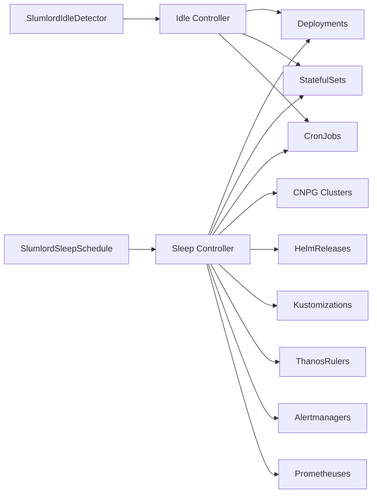

# Slumlord

Kubernetes operator for cost optimization -- automatically scales down workloads during off-hours and detects idle resources.

## Features

**Sleep Schedules** -- scale down workloads on a time-based schedule:
- Scales Deployments and StatefulSets to zero replicas
- Scales Prometheus Operator CRDs (ThanosRuler, Alertmanager, Prometheus) to zero replicas
- Suspends CronJobs, FluxCD HelmReleases and Kustomizations
- Hibernates CNPG PostgreSQL clusters
- Timezone-aware scheduling with day-of-week filters
- Overnight schedule support (e.g., 22:00-06:00)
- Label selectors and name-based matching (with wildcards)
- State preservation -- original replica counts, suspend states, and hibernation annotations are stored for restoration

**Idle Detection** -- detect and optionally scale down underutilized workloads:
- Monitors CPU and memory usage against configurable thresholds
- Configurable idle duration before action
- Two modes: `alert` (report only) or `scale` (auto-scale to zero)
- Supports Deployments, StatefulSets, and CronJobs
- MatchNames wildcard selector (e.g., `prod-*`)
- Finalizer ensures workloads are restored on detector deletion
- Tracks original state for safe restoration

> **Note**: The idle detector requires metrics-server in the cluster. Without it, the operator runs in degraded mode (always returns not-idle).

## Installation

### Helm (recommended)

```bash
helm install slumlord oci://ghcr.io/cschockaert/charts/slumlord --version 2.4.0
```

### From source

```bash
make install  # Install CRDs
make run      # Run locally against current kubeconfig
```

## Usage

### Basic example -- nightly sleep on weekdays

```yaml
apiVersion: slumlord.io/v1alpha1
kind: SlumlordSleepSchedule
metadata:
  name: nightly-sleep
spec:
  selector:
    matchLabels:
      slumlord.io/managed: "true"
    types:
      - Deployment
      - StatefulSet
  schedule:
    start: "22:00"
    end: "06:00"
    timezone: Europe/Paris
    days: [1, 2, 3, 4, 5]
```

### Weekend shutdown

```yaml
apiVersion: slumlord.io/v1alpha1
kind: SlumlordSleepSchedule
metadata:
  name: weekend-stop
spec:
  selector:
    matchLabels:
      slumlord.io/managed: "true"
    types:
      - Deployment
      - StatefulSet
      - CronJob
  schedule:
    start: "00:00"
    end: "23:59"
    timezone: Europe/Paris
    days: [0, 6]
```

### CNPG PostgreSQL hibernation

```yaml
apiVersion: slumlord.io/v1alpha1
kind: SlumlordSleepSchedule
metadata:
  name: pg-hibernate
spec:
  selector:
    matchLabels:
      slumlord.io/managed: "true"
    types:
      - Cluster
  schedule:
    start: "20:00"
    end: "07:00"
    timezone: Europe/Paris
    days: [1, 2, 3, 4, 5]
```

### FluxCD reconciliation suspend

```yaml
apiVersion: slumlord.io/v1alpha1
kind: SlumlordSleepSchedule
metadata:
  name: flux-suspend
spec:
  selector:
    matchLabels:
      slumlord.io/managed: "true"
    types:
      - HelmRelease
      - Kustomization
  schedule:
    start: "21:55"
    end: "06:05"
    timezone: Europe/Paris
    days: [1, 2, 3, 4, 5]
```

> **Important**: When managing FluxCD resources alongside Deployments/StatefulSets, use a wider sleep window for the FluxCD schedule. Suspend Flux reconciliation before scaling workloads, and resume it after restoring them. This prevents Flux from restoring scaled-down workloads during the sleep window.

### Prometheus Operator CRDs

```yaml
apiVersion: slumlord.io/v1alpha1
kind: SlumlordSleepSchedule
metadata:
  name: monitoring-sleep
spec:
  selector:
    matchLabels:
      slumlord.io/managed: "true"
    types:
      - Prometheus
      - Alertmanager
      - ThanosRuler
  schedule:
    start: "20:00"
    end: "07:00"
    timezone: Europe/Paris
    days: [1, 2, 3, 4, 5]
```

> **Note**: The Prometheus Operator itself should NOT be scaled down -- only its managed CRs. The operator must be running to reconcile the CRs back up on wake.

### Idle detection -- alert mode

```yaml
apiVersion: slumlord.io/v1alpha1
kind: SlumlordIdleDetector
metadata:
  name: idle-alert
spec:
  selector:
    matchLabels:
      slumlord.io/managed: "true"
    types:
      - Deployment
      - StatefulSet
  thresholds:
    cpuPercent: 5
    memoryPercent: 10
  idleDuration: "1h"
  action: alert
```

### Idle detection -- auto-scale mode

```yaml
apiVersion: slumlord.io/v1alpha1
kind: SlumlordIdleDetector
metadata:
  name: idle-scaler
spec:
  selector:
    matchNames:
      - "dev-*"
      - "staging-*"
    types:
      - Deployment
  thresholds:
    cpuPercent: 3
    memoryPercent: 5
  idleDuration: "2h"
  action: scale
```

## CRD Reference

### SlumlordSleepSchedule

| Field | Type | Required | Description |
|-------|------|----------|-------------|
| `spec.selector.matchLabels` | `map[string]string` | No | Label selector for target workloads |
| `spec.selector.matchNames` | `[]string` | No | Name patterns (supports wildcards) |
| `spec.selector.types` | `[]string` | No | Workload types to manage. Valid: `Deployment`, `StatefulSet`, `CronJob`, `Cluster`, `HelmRelease`, `Kustomization`, `ThanosRuler`, `Alertmanager`, `Prometheus`. Default: all types |
| `spec.schedule.start` | `string` | Yes | Sleep start time in `HH:MM` format |
| `spec.schedule.end` | `string` | Yes | Wake time in `HH:MM` format |
| `spec.schedule.timezone` | `string` | No | IANA timezone (e.g., `Europe/Paris`). Default: `UTC` |
| `spec.schedule.days` | `[]int` | No | Days of week (0=Sunday, 6=Saturday). Default: every day |

### SlumlordIdleDetector

| Field | Type | Required | Description |
|-------|------|----------|-------------|
| `spec.selector.matchLabels` | `map[string]string` | No | Label selector for target workloads |
| `spec.selector.matchNames` | `[]string` | No | Name patterns with wildcard support (e.g., `prod-*`) |
| `spec.selector.types` | `[]string` | No | Workload types: `Deployment`, `StatefulSet`, `CronJob`. Default: all |
| `spec.thresholds.cpuPercent` | `int32` | No | CPU usage % threshold (0-100). Below = idle |
| `spec.thresholds.memoryPercent` | `int32` | No | Memory usage % threshold (0-100). Below = idle |
| `spec.idleDuration` | `string` | Yes | How long a workload must be idle before action (e.g., `30m`, `1h`) |
| `spec.action` | `string` | Yes | `alert` (report only) or `scale` (auto-scale to zero) |

### Status

```
kubectl get slumlordsleepschedules -A
NAMESPACE   NAME            SLEEPING   START   END     DAYS      AGE
default     nightly-sleep   false      22:00   06:00   Mon-Fri   19h
```

```
kubectl get slumlordidledetectors -A
NAMESPACE   NAME          ACTION   IDLE DURATION   LAST CHECK            AGE
default     idle-alert    alert    1h              2026-02-08T12:00:00Z  1d
```

## How it works

### Sleep Schedules

The operator runs a reconciliation loop every minute for each SlumlordSleepSchedule resource:

1. Checks if the current time (in the configured timezone) falls within the sleep window
2. On **sleep**: scales Deployments/StatefulSets to 0, scales Prometheus Operator CRDs (ThanosRuler, Alertmanager, Prometheus) to 0, suspends CronJobs, hibernates CNPG clusters, and suspends FluxCD HelmReleases/Kustomizations
3. On **wake**: restores all workloads to their original state
4. Original state (replica counts, suspend flags, hibernation annotations) is stored in `status.managedWorkloads` to survive operator restarts

### Idle Detection

The idle detector reconciles every 5 minutes for each SlumlordIdleDetector resource:

1. Lists workloads matching the selector (labels and/or name patterns)
2. Checks resource usage against configured thresholds
3. Tracks how long each workload has been continuously idle
4. In `alert` mode: reports idle workloads in `status.idleWorkloads`
5. In `scale` mode: scales down workloads idle longer than `idleDuration`, stores original state in `status.scaledWorkloads`
6. On detector deletion: restores all scaled workloads via finalizer



## Uninstallation

**Important**: Remove Slumlord resources before uninstalling to restore workloads.

```bash
# Restore all workloads by deleting resources first
kubectl delete slumlordidledetectors --all -A
kubectl delete slumlordsleepschedules --all -A

# Then uninstall
helm uninstall slumlord
```

## Development

```bash
make generate    # Regenerate DeepCopy methods
make manifests   # Regenerate CRD manifests
make test        # Run tests
make lint        # Lint code
make build       # Build binary
```

## License

Apache 2.0
